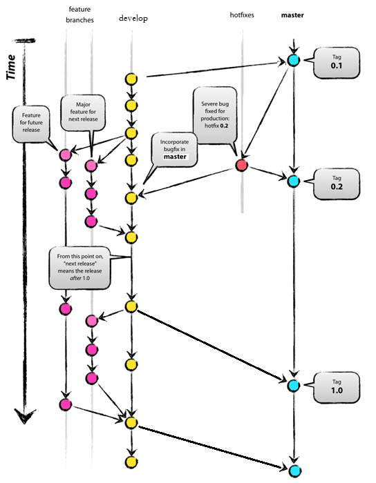

*
Title: git管理规范

Description: 定义了个信公司内部git使用中需要普遍遵循的惯例和要求

Author: 董霖

Date: 2015/4/19

*

#目录

[流程规范](#a1)

[命名规则](#a2)

[注意事项](#a3)

[修订日志](#a4)


<div id="a1"></div>

#流程规范

使用公司内部GitLab管理git工程，地址：<https://115.236.68.62:9990>

根据工作安排设置各组员的代码访问权限。参与项目开发的人员赋予`Developer`权限，打包机git帐号赋予`Report`只读权限。

组员使用各自帐号拉取和提交代码。

**分支介绍**

 - master分支
 
 	主分支，处于随时可发布状态，每个发布版本需要在master打`tag`;master分支<font color=#ff0000>没有commit</font>操作，只合并develop分支和hotfix分支代码;
 
 - develop分支
 
 	开发分支，保留最新开发进度代码;常规需求和bug修改都在develop上修改;发布版本后合并到master分支上;
 	
 	 合并方法
 
	```git
 		git checkout master
 		git merge --squash develop
 		git tag -a 1.2.1
 		git checkout develop
	```
 
 - feature分支
 
 	功能分支，起源develop分支，完成后合并到develop分支，由主管根据具体需求与组员讨论决定是否需要此分支

 - hotfix分支
 
 	修改bug分支，基于master tag切出分支，完成后合并到master分支，并打tag(根据实际情况考虑是否合并到develop分支） ,老版本添加新功能时也使用此分支名字;
 	
 - branch分支
 	
 	基于master tag 切出分支，独立于master分支之外，单独维护；开发过程不需要基于此分支再次切develop分支




- 对于SDK等项目需要同时维护多个版本分支的情况，需要针对各个版本维护`branch分支`，开发工作需要在相应的`branch分支`下进行。

- 定期进行gitlab数据备份，参考：[使用Gitlab一键安装包后的日常备份恢复与迁移](http://segmentfault.com/a/1190000002439923)

****

<div id="a2"></div>

#命名规则


**git工程命名**

`<大产品>-<小产品>-<平台>-<定制版本>-<test>`

说明：

    大产品：大类产品线，如getui,matchbox,gezhi,earthquake等
    小产品：大类产品线下的主产品、子产品或者辅助工具，如sdk,app,devtool,extensiontool等
    平台：产品运行的操作系统或语言版本，如android,ios,wp,linux,c,java等
    定制版本：针对某一特定客户或者特定需求，基于原有产品研发的定制版本，如haier,edj等
    test：如果是测试工程（如UI自动化），在相应的工程后面添加-test

示例：

- earthquake-report-ios
- getui-sdk2-android-haier
- gezhi-app-android
- gezhi-app-android-test

**develop分支**

`develop`


**branch分支命名**

`branch-<版本名称>-<分支创建日期>-<定制>`

说明：

	版本名称：根据产品要求定义的版本名称，如2.4.1.0，1.4.0，0.1.0.0等    
    分支创建日期：该branch分支创建的日期，以"年月日_时分秒"形式表示
    定制：某客户定制分支

示例：

- `branch-2.4.1.0-20141220_172012`
- `branch-0.1.0.0-20150403_223019-didi`


**tag命名**

`tag-<版本名称>-<版本Code>-<创建日期>-<定制>`

说明：

    版本名称：根据产品要求定义的版本名称，如2.4.1.0，1.4.0，0.1.0.0等
    版本Code：如果是Android App工程，需要额外指明VersionCode；如果是其他类型的工程，则无需添加该字段
    创建日期：发布tag创建的日期，以"年月日_时分秒"形式表示

示例：

- `tag-2.4.1.0-20141220_172012-didi`
- `tag-0.1.0.0-1-20150403_223019`

**hotfix分支命名**

`hotfix-<基于的tag版本名称>-<功能名>-<分支创建日期>`

说明：

    基于的tag版本名称：指明基于哪个发布tag版本名称进行hotfix，与相应的发布tag名称对应，如2.4.1.0，1.4.0，0.1.0.0等
    功能名：修改bug名称或功能名字
    分支创建日期：该hotfix分支创建的日期，以年月日_时分秒形式表示

示例：

- `hotfix-2.4.1.0-20141220_172012`
- `hotfix-0.1.0.0-20150403_223019`

**feature分支命名**

`feature-<目标版本号>-<功能名>-<分支创建时间>`

sdk 分支如果需要衍生feature分支，命名规则

`feature-<目标版本号>-<功能名>-<分支名称>-<分支创建时间>` <font color=#FF0000>注:不推荐</font>

说明：

    功能名：指明该feature分支的目的，用关键字概述功能要点，如quickconnect，serverfilter,connectback等
    目标版本号：该功能目标发布版本
    分支创建日期：该feature分支创建的日期，以年月日_时分秒形式表示

示例：

- `feature-quickconnect-2.4.1.0`
- `feature-connectback-0.1.0.0`

****

<div id="a3"></div>

#注意事项

**git工程根目录下必须有.gitignore文件**

使用.gitignore文件可以避免将临时文件、自动生成文件提交到仓库中，语法如下：[Git的.gitignore 配置](http://www.cnblogs.com/haiq/archive/2012/12/26/2833746.html)

典型的.gitignore文件示例如下

Android：

参考Android.gitignore

[gexin-standard/gitignore模板](https://115.236.68.62:9990/frontend/gexin-standard/tree/master/gitignore模板)/Android.gitignore

iOS:

参考ios.gitignore

[gexin-standard/gitignore模板](https://115.236.68.62:9990/frontend/gexin-standard/tree/master/gitignore模板)/ios.gitignore

WP:

参考VisualStudio.gitignore

[gexin-standard/gitignore模板](https://115.236.68.62:9990/frontend/gexin-standard/tree/master/gitignore模板)/VisualStudio.gitignore

C/C++:

参考C++.gitignore

[gexin-standard/gitignore规范](https://115.236.68.62:9990/frontend/gexin-standard/tree/master/gitignore模板)/C++.gitignore


**对于需要手工修改的文件如何提交**

部分配置文件如打包环境配置build.env等，会存在每台电脑上都需要进行相应的手工设置的问题，如果有人不小心提交了这类文件，会导致影响到其他人。对于这类文件，代码库中不直接提交build.env，而是提交build.env.default，由开发人员或者打包脚本负责修改成build.env然后使用。

**尽量使用git pull直接合并分支**

虽然可以通过git fetch或者git pull --no-commit方式只获取最新代码当不立即提交，但是这种方式可能导致本地修改代码长时间不提交，git修改线长时间不合并的问题。强制性的commit可以收敛git修改线，减少合并中的冲突。


****

<div id="a4"></div>

#修订日志


**2015.4.19**

- 初稿

**2015.6.29**

- 修订:修改开发流程，以develop分支为主要开发分支，使master分支独立于开发流程之外


